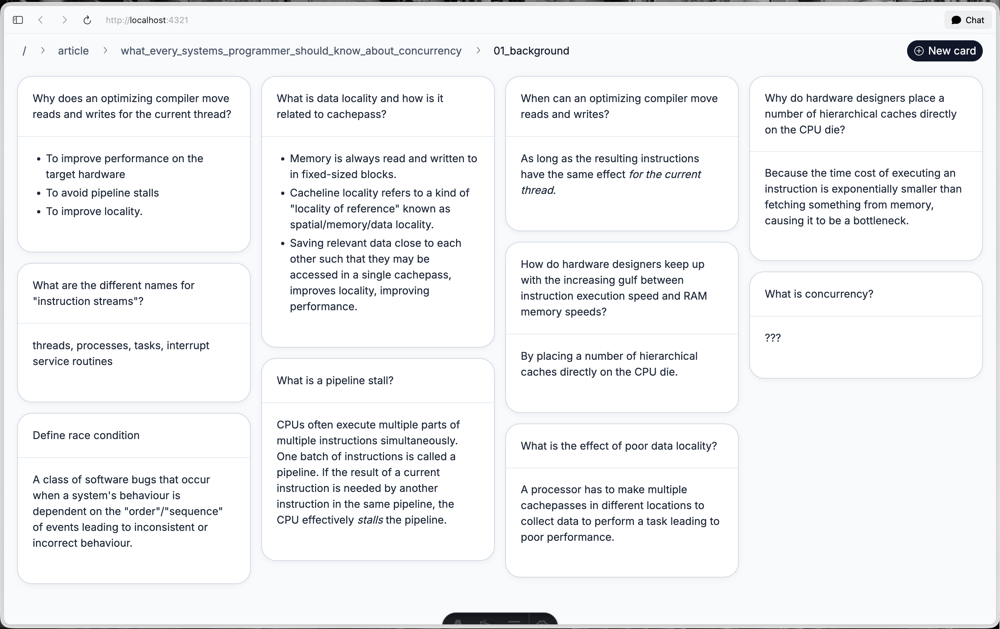

# MyAnki

A fast local frontend for browsing and editing your Anki collection through [AnkiConnect](https://foosoft.net/projects/anki-connect/).

Built with Astro, React, Tailwind, and Bun.

## Screenshot



## What it does

MyAnki gives you a card-browser style interface for your existing Anki collection:

- browse cards in a responsive masonry grid
- navigate hierarchical tags from the breadcrumb bar at the top
- edit note fields inline with markdown-powered editors
- preview rendered HTML, including images and LaTeX from your Anki content
- add or remove tags from each note
- open a note directly in the Anki browser
- suspend, unsuspend, or delete cards/notes
- create a new card inline and save it once you start typing
- autosave field and tag changes
- get toast notifications for saves and errors

## Stack

- Bun
- Astro
- React
- Tailwind CSS
- Framer Motion
- CodeMirror
- Inter font

## Getting started

### Requirements

- [Bun](https://bun.sh/)
- Anki desktop
- The [AnkiConnect add-on](https://ankiweb.net/shared/info/2055492159)

### Run locally

1. Start Anki.
2. Make sure AnkiConnect is installed and enabled.
3. Install dependencies:

```bash
bun install
```

4. Start the dev server:

```bash
bun run dev
```

5. Open:

```text
http://localhost:4321
```

MyAnki talks to AnkiConnect at:

```text
http://127.0.0.1:8765
```

## Available scripts

```bash
bun run dev      # start the Astro dev server
bun run build    # build for production
bun run preview  # preview the production build locally
```

## Notes

- This app is meant for collection browsing and editing, not review/study mode.
- Breadcrumb tag navigation lets you jump directly to a path or open child segments from the separator control.
- Cards refresh periodically so collection changes made in Anki show up in the UI.
- Field content is edited as markdown and saved back to Anki as HTML.
